<div align="center">

  

  <br/><br/>

  <a href="https://nk-digital-craft-portfolio.vercel.app">
    
  </a>
  &nbsp;
  <a href="https://github.com/nkwebseller-op/NK-digital-craft-portfolio">
    
  </a>
  &nbsp;
  
  &nbsp;
  

</div>

---

# NK Digital Craft — Portfolio

> **AI-Powered Websites · Full Stack Development · SEO · Digital Marketing · Automation**
>
> Official portfolio of **Nikhil Kumar Singh** — Founder & CEO, NK Digital Craft, Puri, Odisha, India.

---

## About

NK Digital Craft is a professional digital solutions agency founded by Nikhil Kumar Singh with 10+ years of experience. We help businesses build a powerful digital identity through AI websites, full-stack development, UI/UX design, SEO, digital marketing, and automation — tailored to real business needs.

| | |
|---|---|
| **Founder & CEO** | Nikhil Kumar Singh |
| **Location** | Puri, Odisha, India |
| **Experience** | 10+ Years |
| **Services** | 25+ Digital Services |
| **Live Client Project** | [Aura Home Solutions](https://aurahomesodisha.com) |
| **Contact** | [WhatsApp](https://wa.me/918260999311) · [nkbusinessout@gmail.com](mailto:nkbusinessout@gmail.com) |

---

## Live Demo

**[https://nk-digital-craft-portfolio.vercel.app](https://nk-digital-craft-portfolio.vercel.app)**

Auto-deployed from the `main` branch via Vercel. Every push triggers a new production build.

---

## Services Offered

- AI Website Development
- Full Stack Web Development
- UI/UX Design & Branding
- SEO & Google Ranking
- Digital Marketing & Ads
- AI Agents & Automation
- App Development
- Website Maintenance & Support
- Business Growth Solutions

---

## Tech Stack

| Layer | Technology |
|---|---|
| **Framework** | Next.js 14.1.1 (Pages Router) |
| **Styling** | Tailwind CSS 3.x + Custom Theme Tokens |
| **Animations** | Framer Motion (page transitions, fade-in variants) |
| **Sliders** | Swiper.js (ServiceSlider, WorkSlider, TestimonialSlider) |
| **Particles** | tsparticles / react-tsparticles |
| **Counters** | react-countup |
| **Icons** | react-icons (FaReact, SiNextdotjs, SiOpenai, …) |
| **Contact Form** | Netlify Forms |
| **Deployment** | Vercel (CI/CD via GitHub) |

### Color Palette

| Token | Hex | Usage |
|---|---|---|
| `primary` | `#0A1633` | Dark navy — backgrounds |
| `secondary` | `#1E3A8A` | Deep royal blue — overlays |
| `accent` | `#0EA5E9` | Bright cyan — highlights, buttons, logo dot |

---

## Project Structure

```
NK-digital-craft-portfolio/
├── components/
│   ├── Avatar.jsx          # Profile photo
│   ├── Bulb.jsx            # Decorative SVG
│   ├── Circles.jsx         # Background circles
│   ├── Layout.jsx          # SEO + nav shell
│   ├── Nav.jsx             # Navigation
│   ├── ParticlesContainer.jsx  # Particle background
│   ├── ServiceSlider.jsx   # Services carousel
│   ├── Socials.jsx         # Social media links
│   ├── TestimonialSlider.jsx   # Team section
│   ├── Transition.jsx      # Page wipe animation
│   └── WorkSlider.jsx      # Portfolio carousel
├── pages/
│   ├── index.jsx           # Home / Hero
│   ├── about/              # About + skills + counters
│   ├── services/           # Services slider page
│   ├── work/               # Portfolio page
│   ├── testimonials/       # Team page
│   └── contact/            # Contact form
├── public/
│   ├── avatar.png          # Founder photo (transparent PNG)
│   ├── t-avt-1.png         # Team — Nikhil Kumar Singh
│   ├── t-avt-2.png         # Team — Priyaranjan Sahoo
│   ├── t-avt-3.png         # Team — U. Shiva
│   └── ...                 # Background SVGs, work thumbnails
├── styles/
│   └── globals.css         # Tailwind base + Swiper overrides
└── tailwind.config.js      # Theme tokens + custom config
```

---

## Getting Started

### Prerequisites

- Node.js 18+
- npm or yarn

### Installation

```bash
# Clone the repository
git clone https://github.com/nkwebseller-op/NK-digital-craft-portfolio.git
cd NK-digital-craft-portfolio

# Install dependencies
npm install

# Start development server
npm run dev
```

Open [http://localhost:3000](http://localhost:3000) in your browser.

### Build for Production

```bash
npm run build
npm start
```

---

## Deployment

This project is deployed on **Vercel** with automatic CI/CD from the `main` branch.

Every `git push origin main` triggers a new production deployment automatically — no manual steps needed.

**Production URL:** https://nk-digital-craft-portfolio.vercel.app

---

## Contact & Business Enquiries

| Channel | Details |
|---|---|
| **WhatsApp** | [+91 82609 99311](https://wa.me/918260999311) |
| **Email** | [nkbusinessout@gmail.com](mailto:nkbusinessout@gmail.com) |
| **Instagram** | [@nk_digital_craft](https://instagram.com/nk_digital_craft) |
| **GitHub** | [nkwebseller-op](https://github.com/nkwebseller-op) |

---

## Team

| Name | Role |
|---|---|
| **Nikhil Kumar Singh** | Founder & CEO |
| **Priyaranjan Sahoo** | Manager |
| **U. Shiva** | Client Coordination |

---

## License

This project is based on the [3D Portfolio Website](https://github.com/safak/3D-Portfolio-Websites-Free) template by Safak, released under the MIT License. All content, branding, and business identity belongs to NK Digital Craft.

---

<div align="center">

Made with dedication by **NK Digital Craft** · Puri, Odisha, India

[nk-digital-craft-portfolio.vercel.app](https://nk-digital-craft-portfolio.vercel.app)

</div>
